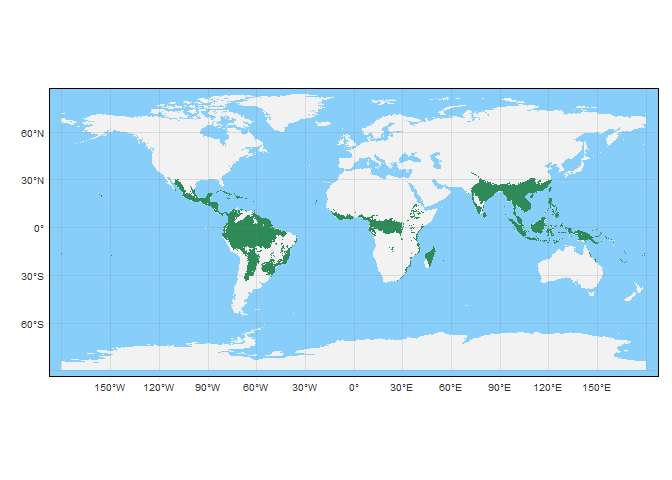

Mapping with R
================
Abhishek Kumar
7 September 2020

Data
====

I want to prepare a map for global distribution of tropical forests. For this, I will be using the spatial data provided by the [The Nature Conservancy](https://www.nature.org/en-us/).

-   [Terrestrial Ecoregions](https://geospatial.tnc.org/datasets/b1636d640ede4d6ca8f5e369f2dc368b) spatial data \[51 Mb\]

The country level data for world countries can be obtained from the [Natural Earth](https://www.naturalearthdata.com/) at desired level of scale from the following links:

-   [Cultural Admin 0 – Countries at 1:50](https://www.naturalearthdata.com/http//www.naturalearthdata.com/download/50m/cultural/ne_50m_admin_0_countries.zip)

Packages
========

The `sf` package will be used to read the shapefiles using the function and the package `tmap` will be used for visualisation and mapping. The `dplyr` package will be used for data manipulation.

``` r
library(sf)
```

    ## Linking to GEOS 3.8.0, GDAL 3.0.4, PROJ 6.3.1

``` r
library(tmap)
library(dplyr)
```

    ## 
    ## Attaching package: 'dplyr'

    ## The following objects are masked from 'package:stats':
    ## 
    ##     filter, lag

    ## The following objects are masked from 'package:base':
    ## 
    ##     intersect, setdiff, setequal, union

Reading the Data
================

The Geospatial Data Abstraction Library (GDAL) is the swiss army knife for spatial data: it reads and writes vector and raster data from and to practically every file format, or database, of significance. Package `sf` reads and writes using GDAL by the functions $\\verb |st\_read()|$ and $\\verb |st\_write()|$.

The data model GDAL uses:

-   a data source, which may be a file, directory, or database
-   a layer, which is a single geospatial dataset inside a file or directory or e.g. a table in a database.
-   the specification of a driver (i.e., which format)
-   driver-specific reading or writing data sources, or layers

This may sound complex, but it is needed to map to over 200 data formats! Package `sf` tries hard to simplify this where possible (e.g. a file contains a single layer), but this vignette will try to point you to the options

``` r
ec_sf <- st_read("~/ArcGIS/Ecoregions/terr-ecoregions-TNC/tnc_terr_ecoregions.shp")
```

    ## Reading layer `tnc_terr_ecoregions' from data source `C:\Users\ARVIND\Documents\ArcGIS\Ecoregions\terr-ecoregions-TNC\tnc_terr_ecoregions.shp' using driver `ESRI Shapefile'
    ## Simple feature collection with 814 features and 16 fields
    ## geometry type:  MULTIPOLYGON
    ## dimension:      XY
    ## bbox:           xmin: -180 ymin: -89.9 xmax: 180 ymax: 83.6236
    ## geographic CRS: WGS 84

``` r
world <- st_read("~/ArcGIS/Admin/World_admin/ne_50m_admin_0_countries.shp")
```

    ## Reading layer `ne_50m_admin_0_countries' from data source `C:\Users\ARVIND\Documents\ArcGIS\Admin\World_admin\ne_50m_admin_0_countries.shp' using driver `ESRI Shapefile'
    ## Simple feature collection with 241 features and 94 fields
    ## geometry type:  MULTIPOLYGON
    ## dimension:      XY
    ## bbox:           xmin: -180 ymin: -89.99893 xmax: 180 ymax: 83.59961
    ## geographic CRS: WGS 84

``` r
ec_sf %>% select(WWF_MHTNUM, WWF_MHTNAM) %>% group_by(WWF_MHTNUM, WWF_MHTNAM) %>% summarise(n = n())
```

    ## `summarise()` regrouping output by 'WWF_MHTNUM' (override with `.groups` argument)

    ## Simple feature collection with 16 features and 3 fields
    ## geometry type:  MULTIPOLYGON
    ## dimension:      XY
    ## bbox:           xmin: -180 ymin: -89.9 xmax: 180 ymax: 83.6236
    ## geographic CRS: WGS 84
    ## # A tibble: 16 x 4
    ## # Groups:   WWF_MHTNUM [16]
    ##    WWF_MHTNUM WWF_MHTNAM                 n                              geometry
    ##         <int> <chr>                  <int>                    <MULTIPOLYGON [°]>
    ##  1          1 Tropical and Subtropi~   230 (((30.54887 -30.02758, 30.58254 -29.~
    ##  2          2 Tropical and Subtropi~    55 (((-157.8863 21.33392, -157.8865 21.~
    ##  3          3 Tropical and Subtropi~    17 (((101.3969 -2.32193, 101.3914 -2.32~
    ##  4          4 Temperate Broadleaf a~    88 (((144.7865 -40.50255, 144.788 -40.5~
    ##  5          5 Temperate Conifer For~    48 (((91.83731 27.42455, 91.81181 27.42~
    ##  6          6 Boreal Forests/Taiga      22 (((-79.25279 52.07138, -79.31973 51.~
    ##  7          7 Tropical and Subtropi~    48 (((-52.10707 -31.98115, -52.10097 -3~
    ##  8          8 Temperate Grasslands,~    40 (((36.91665 32.22848, 36.86234 32.20~
    ##  9          9 Flooded Grasslands an~    26 (((-57.57025 -25.55573, -57.58357 -2~
    ## 10         10 Montane Grasslands an~    50 (((171.3839 -43.31999, 171.3928 -43.~
    ## 11         11 Tundra                    30 (((-162.2231 -78.73584, -162.1334 -7~
    ## 12         12 Mediterranean Forests~    39 (((19.81867 -31.46551, 19.7873 -31.4~
    ## 13         13 Deserts and Xeric Shr~    95 (((133.0141 -31.76667, 133.0104 -31.~
    ## 14         14 Mangroves                 19 (((29.20549 -31.94691, 29.19901 -31.~
    ## 15         98 Inland Water               3 (((-69.69894 -15.2406, -69.69627 -15~
    ## 16         99 Rock and Ice               4 (((113.1178 -67.57474, 113.2424 -67.~

Processign data
===============

The variable `WWF_MHTNUM` uses values for different ecoregions

-   1.  Tropical and Subtropical Moist Broadleaf Forests

-   1.  Tropical and Subtropical Dry Broadleaf Forests

-   1.  Tropical and Subtropical Coniferous Forests

So, we can filter the values either &lt;4 or &lt;=3

``` r
ec_df <- ec_sf %>% filter(WWF_MHTNUM < 4)
```

Plotting the data
=================

-   The `tm_shape()` function takes a spatial object (with a class from `sf`, `sp`, `stars`, or `raster`).
-   `tm_fill()` used to fill the polygons

``` r
tm_shape(world) + tm_fill(col = "grey95") + 
      tm_shape(ec_df) + tm_fill(col = "seagreen") +
      tm_layout(bg.color = "lightskyblue") +
      tm_graticules(alpha = 0.2)
```


